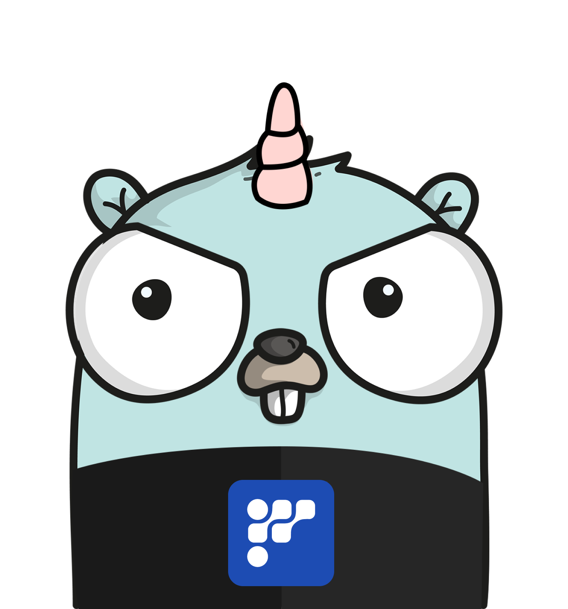

# play.go.ai

play.go.ai is an AI-powered Go code editor built with [Next.js](https://nextjs.org) and [Vercel AI SDK](https://sdk.vercel.ai/) using [FriendliAI](https://friendli.ai).

&envLink=https%3A%2F%2Fsuite.friendli.ai%2Fdefault-team%2Fsettings%2Ftokens&project-name=play-go-ai&repository-name=play-go-ai&demo-title=play-go-ai&demo-description=Golang%20Playground%20Driven%20by%20AI%2C%20Created%20from%20FriendliAI%20Hackathon&demo-url=https%3A%2F%2Fplay-go-ai.vercel.app&demo-image=https%3A%2F%2Fplay-go-ai.vercel.app%2Fopengraph-image.png>)

## Developing

- Clone the repository
- Create a `.env.local` file with `FRIENDLI_TOKEN=your-api-key` where `your-api-key` is your friendli suite API key from [suite.friendli.ai](https://suite.friendli.ai/default-team/settings/tokens).
- Run `pnpm install` to install dependencies.
- Run `pnpm dev` to start the development server.
